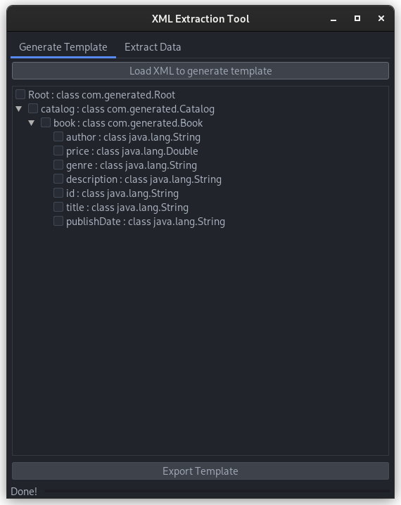

##  XML Extraction Tool

A tool to selectively extract data from xml files and export to xls file with gui or command line tool. command line
tool for using in automated environments for advanced users. gui for ease of use for normal users.

## Usage :

```
"--gui"        - to start application in GUI mode (only used individually)
"--template"   - to define template, when not defined it will automatically extract all data (optional)
"--input"      - to define folder containing xml files
"--output"     - to define folder to export output
"--depth"      - to define depth (optional)
"--merge"      - to merge all output files into one (optional)
```

## Usage Examples :

jar file name is "XML_Tool.jar" replace it actual name of jar file.

for using as command line application

```
java jar XML_Tool.jar --template="/path/to/template" --input="/path/to/xml/folder" --output="/path/to/output/folder" --depth=1 --merge
```

for using the application with GUI

```
java jar XML_Tool.jar --gui
```

for gui do not add any more argument than --gui since you will give input via gui

## Screenshots

Screenshot for GUI mode showing an example xml to generate template by selecting parameters that needs to be extracted

